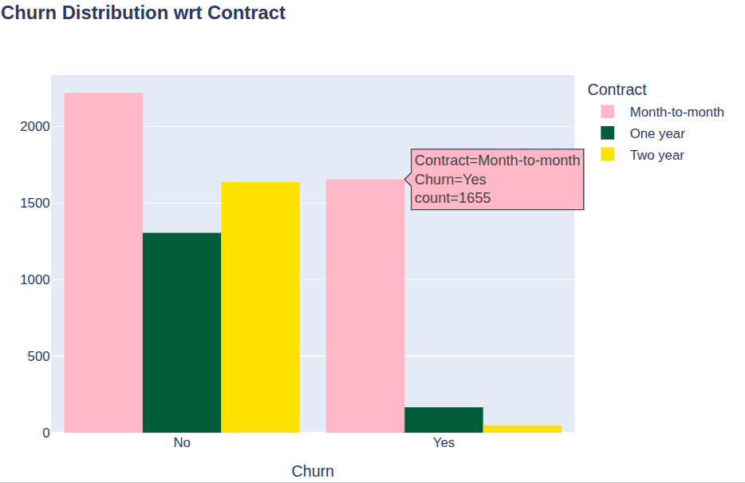
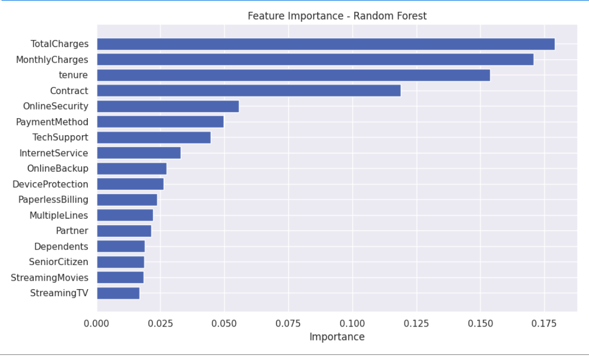

# 📊 Customer Churn Prediction

Predicting telecom customer churn using EDA and a Random Forest Classifier — analyzing 7,000+ customers to uncover key churn drivers and help reduce customer attrition.

## 🎯 Project Overview
Customer churn costs telecom companies billions annually. This project analyzes customer behavior and service usage patterns to predict which customers are likely to cancel their subscription, enabling proactive retention strategies.

## 📁 Dataset
- **7,043 customers**, 21 features (demographics, subscribed services, billing details)
- **Target:** `Churn` (Yes/No) — ~26.6% churn rate
- Source: Telco Customer Churn Dataset (IBM Sample Data)

## 🔍 Approach
1. **Data Cleaning** — handled missing values, fixed data types, removed invalid records
2. **Exploratory Data Analysis** — visualized churn patterns across contract type, tenure, payment method, and add-on services
3. **Feature Engineering** — label encoding for categorical variables, correlation analysis
4. **Modeling** — Random Forest Classifier with `class_weight='balanced_subsample'` to address class imbalance

## 📊 Sample Visualizations




*(See the notebook for the full set of EDA visualizations.)*

## 💡 Key Findings
| Insight | Detail |
|---|---|
| Contract type matters most | Month-to-month customers churn at ~75% vs. ~3% for two-year contracts |
| Support services reduce churn | Customers without online security/tech support churn significantly more |
| Top predictors | `TotalCharges`, `MonthlyCharges`, `tenure`, `Contract` |

## 📈 Model Performance
| Metric | Score |
|---|---|
| Accuracy | 79.2% |
| Precision (Churn) | 64% |
| Recall (Churn) | 48% |

> **Note:** Recall on churned customers is moderate due to class imbalance (~27% churn rate) in the dataset. Addressed using `class_weight='balanced_subsample'`; future work could explore SMOTE or decision-threshold tuning.

## 🔮 Future Improvements
- Address class imbalance further using SMOTE
- Try XGBoost/LightGBM and compare performance
- Deploy as a simple Streamlit app for live predictions
- Hyperparameter tuning via GridSearchCV

## 🚀 Business Recommendations
- Incentivize longer-term contracts (discounts/loyalty perks) to reduce month-to-month churn
- Bundle online security and tech support with month-to-month plans
- Proactively target high-risk customers (low tenure + high monthly charges + no add-ons) with retention offers

## 🛠️ Tech Stack
`Python` `pandas` `NumPy` `scikit-learn` `Plotly` `Seaborn` `Matplotlib`

## ⚙️ How to Run
```bash
git clone https://github.com/samarthboraste/customer-churn-prediction.git
cd customer-churn-prediction
pip install -r requirements.txt
```
Then open `Customer-Churn-Random_forest.ipynb` in Jupyter or Google Colab and run all cells.
## 📬 Contact
**Samarth Boraste** — feel free to connect on [LinkedIn]-https://www.linkedin.com/in/samarthb77/

